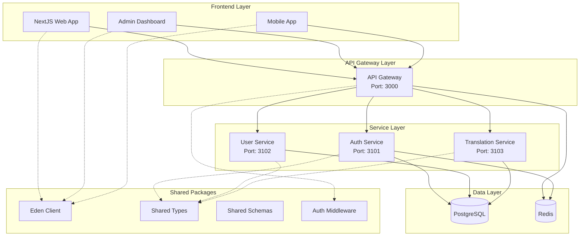

# 📋 System Overview - WIBUSYSTEM

## 🎯 Giới thiệu

**WIBUSYSTEM** là một nền tảng microservices hiện đại được xây dựng với ElysiaJS, TurboRepo và NextJS. Hệ thống được thiết kế theo nguyên tắc "API-first" với end-to-end type safety và kiến trúc modular cho khả năng mở rộng cao.

## 🏗️ High-level Architecture



## 🎯 Core Principles

### 1. **Microservices Architecture**

- **Single Responsibility**: Mỗi service chỉ chịu trách nhiệm cho một business domain
- **Loosely Coupled**: Services giao tiếp qua well-defined APIs
- **Technology Agnostic**: Mỗi service có thể sử dụng tech stack phù hợp
- **Independent Deployment**: Services có thể deploy độc lập

### 2. **API-First Design**

- **Contract-Driven Development**: APIs được định nghĩa trước implementation
- **OpenAPI Specification**: Tất cả APIs được document theo chuẩn OpenAPI
- **Version Management**: API versioning strategy rõ ràng
- **Backward Compatibility**: Đảm bảo tương thích ngược

### 3. **Type Safety**

- **End-to-End Types**: Type safety từ database đến frontend
- **Schema-Driven**: Database schema drives TypeScript types
- **Runtime Validation**: Validation tại runtime với Elysia.t
- **No Code Generation**: Type safety without code generation (Eden)

### 4. **Developer Experience**

- **Monorepo Organization**: Code organization với TurboRepo
- **Hot Reload**: Fast development feedback loop
- **Shared Packages**: Reusable components across services
- **Consistent Tooling**: Unified development tools và patterns

## 🏛️ Service Architecture

### **API Gateway** (`@repo/api-gateway`)

**Responsibilities:**

- Authentication & Authorization
- Request routing & load balancing
- Rate limiting & security
- Request/Response logging
- CORS handling
- Service discovery

**Key Features:**

- JWT token validation
- Redis-based rate limiting
- Health check monitoring
- Swagger documentation
- Error handling & formatting

### **Auth Service** (`@repo/auth-service`)

**Responsibilities:**

- User authentication & authorization
- JWT token management
- Session management
- Password reset flows
- Multi-factor authentication
- OAuth integrations

**Key Features:**

- Secure password hashing
- JWT + Refresh token strategy
- Email verification
- Role-based access control (RBAC)
- Audit logging

### **User Service** (`@repo/user-service`)

**Responsibilities:**

- User profile management
- User relationships (follows)
- Organization management
- User preferences
- User search & discovery

**Key Features:**

- Rich user profiles
- Organization memberships
- User following system
- Profile customization
- Search & filtering

### **Translation Service** (`@repo/translation-service`)

**Responsibilities:**

- Translation project management
- Translation group coordination
- Content translation workflows
- Quality assurance
- Translation history

**Key Features:**

- Project collaboration
- Translation workflows
- Quality metrics
- Version control
- Team management

## 📦 Shared Packages Strategy

### **Eden Client** (`@repo/eden-client`)

- Type-safe API client cho frontend
- End-to-end type safety với Eden Treaty
- Automatic request/response typing
- Built-in error handling

### **Shared Types** (`@repo/shared-types`)

- Common TypeScript interfaces
- Database entity types
- API request/response types
- Utility types

### **Shared Schemas** (`@repo/shared-schemas`)

- Elysia validation schemas
- Reusable validation logic
- Model definitions
- Schema versioning

### **Auth Middleware** (`@repo/auth-middleware`)

- JWT validation logic
- Authentication helpers
- Role-based authorization
- Session management

## 🔄 Data Flow Architecture

### **Request Flow**

```
Frontend → API Gateway → Service → Database
    ↓         ↓           ↓         ↓
  Eden     JWT Auth   Business   PostgreSQL
 Client   Validation   Logic    + Drizzle
```

### **Authentication Flow**

```
1. User login → Auth Service
2. JWT token generated
3. Token stored in Redis
4. Frontend receives tokens
5. Subsequent requests include JWT
6. Gateway validates token
7. Request forwarded to services
```

### **Service Communication**

```
Gateway ←→ Services (HTTP/REST)
Services ←→ Database (Drizzle ORM)
Services ←→ Redis (Caching/Sessions)
```

## 🚀 Technology Stack

### **Runtime & Framework**

- **Runtime**: Bun (fast JavaScript runtime)
- **Backend Framework**: ElysiaJS (high-performance TypeScript framework)
- **Frontend Framework**: NextJS 14 (React with App Router)

### **Database & ORM**

- **Database**: PostgreSQL (relational database)
- **ORM**: Drizzle (type-safe SQL toolkit)
- **Migrations**: Drizzle Kit (schema migrations)
- **Cache**: Redis (in-memory cache)

### **Development Tools**

- **Language**: TypeScript (type safety)
- **Build Tool**: TurboRepo (monorepo management)
- **Package Manager**: Bun (fast package installation)
- **Testing**: Bun Test (built-in testing)

### **DevOps & Deployment**

- **Containers**: Docker (containerization)
- **Orchestration**: Kubernetes (container orchestration)
- **CI/CD**: GitHub Actions (continuous integration)
- **Monitoring**: Prometheus + Grafana

## 🔒 Security Architecture

### **Authentication & Authorization**

- **JWT Tokens**: Stateless authentication
- **Refresh Tokens**: Secure token renewal
- **Role-Based Access Control**: Granular permissions
- **Session Management**: Redis-based sessions

### **API Security**

- **Rate Limiting**: Prevent API abuse
- **CORS Configuration**: Cross-origin security
- **Input Validation**: Prevent injection attacks
- **Error Handling**: Secure error responses

### **Data Security**

- **Password Hashing**: bcrypt/argon2
- **Data Encryption**: Sensitive data encryption
- **SQL Injection Prevention**: Parameterized queries
- **Audit Logging**: Security event tracking

## 📊 Scalability Strategy

### **Horizontal Scaling**

- **Stateless Services**: Easy horizontal scaling
- **Load Balancing**: Distribute traffic across instances
- **Database Sharding**: Partition data for performance
- **Caching Strategy**: Redis for performance

### **Performance Optimization**

- **Connection Pooling**: Efficient database connections
- **Query Optimization**: Optimized database queries
- **CDN Integration**: Static asset delivery
- **Compression**: Response compression

### **Monitoring & Observability**

- **Health Checks**: Service health monitoring
- **Metrics Collection**: Performance metrics
- **Distributed Tracing**: Request tracing
- **Log Aggregation**: Centralized logging

## 🔄 Development Workflow

### **Code Organization**

```
WIBUSYSTEM/
├── apps/          # Applications
├── packages/      # Shared packages
├── docs/          # Documentation
├── tools/         # Development tools
└── configs/       # Shared configurations
```

### **Development Process**

1. **Feature Development**: Feature branches with PR reviews
2. **Testing**: Unit, integration, và E2E tests
3. **Type Checking**: Continuous TypeScript validation
4. **Code Quality**: ESLint, Prettier, và SonarQube
5. **Documentation**: Automated API documentation

### **Deployment Pipeline**

1. **Development**: Local development với hot reload
2. **Staging**: Integration testing environment
3. **Production**: Blue-green deployment strategy
4. **Rollback**: Quick rollback capabilities

## 📈 Future Roadmap

### **Phase 1: Foundation** ✅

- Basic microservices setup
- Authentication system
- API Gateway implementation
- Shared packages structure

### **Phase 2: Core Features** 🚧

- User management system
- Translation workflows
- Organization management
- Advanced authentication

### **Phase 3: Advanced Features** 📋

- Real-time notifications
- Advanced analytics
- Mobile applications
- Third-party integrations

### **Phase 4: Scale & Optimize** 📋

- Performance optimization
- Advanced monitoring
- Auto-scaling implementation
- Multi-region deployment

---

**WIBUSYSTEM được thiết kế để scale từ startup đến enterprise với kiến trúc modern và developer experience tuyệt vời.**
