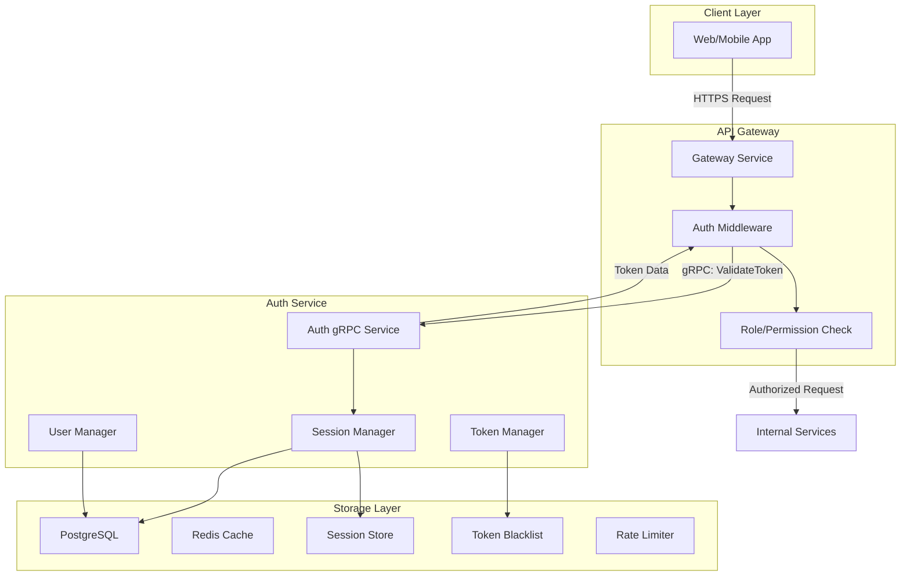

# Thiết kế Hệ thống Authentication - WibuSystem

Tài liệu này mô tả chi tiết thiết kế cho hệ thống authentication, lấy cảm hứng từ Clerk với các tính năng mở rộng cho hệ sinh thái WibuSystem. Hệ thống tập trung vào việc cung cấp dịch vụ authentication thông qua gRPC cho Gateway và các service khác.

## 1. Kiến trúc Hệ thống Tổng quan

### 1.1. Luồng Xác thực Chính



### 1.2. Thành phần Hệ thống

- **API Gateway**: Điểm vào duy nhất, xử lý authentication và authorization
- **Auth Service (gRPC)**: Dịch vụ cốt lõi xử lý logic authentication
- **PostgreSQL**: Lưu trữ dữ liệu người dùng, session, roles
- **Redis**: Cache session, token blacklist, rate limiting

## 2. Thiết kế gRPC Service

### 2.1. Mở rộng Proto Definition

```protobuf
syntax = "proto3";

package com.wibusystem.grpc.auth;

service AuthService {
  rpc validateToken(ValidateTokenRequest) returns (ValidateTokenResponse);
}

message ValidateTokenRequest {
  string token = 1;
  string device_id = 2;
  string session_id = 3;
  string ip_address = 4;
}

message ValidateTokenResponse {
  int32 status = 1;
  string status_code = 2;
  string message = 3;
  TokenData data = 4;
  optional ErrorData error = 5;
  string metadata = 6;
  string timestamp = 7;
  string request_id = 8;

  message TokenData {
    int32 id = 1;
    repeated string roles = 2;
    repeated string permissions = 3;
    bool verified_email = 4;
    bool verified_phone = 5;
    string device_id = 6;
    string session_id = 7;
  }
}

message ErrorData {
  string code = 1;
  string message = 2;
}
```

### 2.2. Context Headers từ Gateway

Auth Service sẽ nhận context từ Gateway qua các headers:

- `x-user-id`: ID của user đã được xác thực (cho các endpoint cần auth)
- `x-device-id`: ID thiết bị
- `x-session-id`: ID phiên đăng nhập
- `x-request-id`: Request tracking ID
- `x-client-ip`: IP address của client
- `x-user-agent`: User agent string

## 3. Tính năng Chính

### 3.1. Authentication Core

#### 3.1.1. Đăng ký (Register)

- **Input**: Email, password, display_name, device info
- **Process**:
  - Validate input data
  - Check email uniqueness
  - Hash password với Argon2 (Bun.password)
  - Create user record
  - Generate verification code
  - Send welcome email
  - Create initial session
  - Generate JWT tokens
- **Output**: Access token, refresh token, user info

#### 3.1.2. Đăng nhập (Login)

- **Input**: Email, password, device info, optional MFA code
- **Process**:
  - Validate credentials
  - Check account status (active, not deleted)
  - Verify MFA if enabled
  - Create new session
  - Generate JWT tokens
  - Update last login time
  - Cache session in Redis
- **Output**: Access token, refresh token, user info

#### 3.1.3. Refresh Token

- **Input**: Refresh token, device_id, session_id
- **Process**:
  - Validate refresh token
  - Check session validity
  - Generate new access token
  - Update session last_used_at
  - Update Redis cache
- **Output**: New access token

#### 3.1.4. Logout

- **Input**: Session ID, device ID
- **Process**:
  - Invalidate session
  - Add tokens to blacklist (Redis)
  - Remove session from cache
  - Update database
- **Output**: Success confirmation

### 3.2. Session Management với Redis

#### 3.2.1. Session Storage Strategy

```typescript
// Redis key patterns
const SESSION_KEY = `session:${sessionId}`;
const USER_SESSIONS_KEY = `user:${userId}:sessions`;
const TOKEN_BLACKLIST_KEY = `blacklist:${tokenId}`;
const RATE_LIMIT_KEY = `rate_limit:${userId}:${action}`;

// Session data structure in Redis
interface SessionCache {
  user_id: number;
  session_id: string;
  device_id: string;
  device_name: string;
  device_type: string;
  ip_address: string;
  roles: string[];
  permissions: string[];
  is_active: boolean;
  expires_at: number;
  last_used_at: number;
}
```

#### 3.2.2. Session Lifecycle

1. **Session Creation**: Store in both PostgreSQL và Redis
2. **Session Validation**: Check Redis first, fallback to PostgreSQL
3. **Session Update**: Update both stores
4. **Session Expiration**: TTL trong Redis, cleanup job cho PostgreSQL

### 3.3. Token Management

#### 3.3.1. JWT Structure

```typescript
interface JWTPayload {
  sub: string; // user_id
  email: string;
  roles: string[];
  permissions: string[];
  session_id: string;
  device_id: string;
  iat: number; // issued at
  exp: number; // expires at
  jti: string; // JWT ID for blacklisting
}
```

#### 3.3.2. Token Blacklisting

- Store revoked token JTIs trong Redis với TTL
- Check blacklist trong token validation
- Cleanup expired blacklist entries

### 3.4. Rate Limiting với Redis

```typescript
// Rate limiting strategies
const RATE_LIMITS = {
  LOGIN_ATTEMPTS: { max: 5, window: 900 }, // 5 attempts per 15 minutes
  REGISTER_ATTEMPTS: { max: 3, window: 3600 }, // 3 attempts per hour
  PASSWORD_RESET: { max: 3, window: 3600 }, // 3 requests per hour
  VERIFICATION_CODE: { max: 5, window: 900 }, // 5 codes per 15 minutes
};
```

## 4. Error Handling & Response Format

### 4.1. Standardized Error Codes

```typescript
export const AUTH_ERROR_CODES = {
  // Authentication errors
  INVALID_CREDENTIALS: "INVALID_CREDENTIALS",
  ACCOUNT_LOCKED: "ACCOUNT_LOCKED",
  ACCOUNT_DISABLED: "ACCOUNT_DISABLED",
  EMAIL_NOT_VERIFIED: "EMAIL_NOT_VERIFIED",
  MFA_REQUIRED: "MFA_REQUIRED",
  INVALID_MFA_CODE: "INVALID_MFA_CODE",

  // Token errors
  TOKEN_EXPIRED: "TOKEN_EXPIRED",
  TOKEN_INVALID: "TOKEN_INVALID",
  TOKEN_BLACKLISTED: "TOKEN_BLACKLISTED",
  REFRESH_TOKEN_EXPIRED: "REFRESH_TOKEN_EXPIRED",

  // Session errors
  SESSION_EXPIRED: "SESSION_EXPIRED",
  SESSION_NOT_FOUND: "SESSION_NOT_FOUND",
  DEVICE_MISMATCH: "DEVICE_MISMATCH",

  // Validation errors
  EMAIL_ALREADY_EXISTS: "EMAIL_ALREADY_EXISTS",
  WEAK_PASSWORD: "WEAK_PASSWORD",
  INVALID_EMAIL_FORMAT: "INVALID_EMAIL_FORMAT",

  // Rate limiting
  TOO_MANY_ATTEMPTS: "TOO_MANY_ATTEMPTS",
  RATE_LIMIT_EXCEEDED: "RATE_LIMIT_EXCEEDED",

  // System errors
  DATABASE_ERROR: "DATABASE_ERROR",
  REDIS_ERROR: "REDIS_ERROR",
  EMAIL_SERVICE_ERROR: "EMAIL_SERVICE_ERROR",
} as const;
```

### 4.2. Multi-language Support

```typescript
// Vietnamese error messages
const VI_ERROR_MESSAGES = {
  INVALID_CREDENTIALS: "Email hoặc mật khẩu không chính xác",
  ACCOUNT_LOCKED: "Tài khoản đã bị khóa",
  ACCOUNT_DISABLED: "Tài khoản đã bị vô hiệu hóa",
  EMAIL_NOT_VERIFIED: "Email chưa được xác thực",
  MFA_REQUIRED: "Yêu cầu xác thực đa yếu tố",
  INVALID_MFA_CODE: "Mã xác thực không hợp lệ",
  TOKEN_EXPIRED: "Token đã hết hạn",
  TOKEN_INVALID: "Token không hợp lệ",
  EMAIL_ALREADY_EXISTS: "Email đã tồn tại",
  TOO_MANY_ATTEMPTS: "Quá nhiều lần thử, vui lòng thử lại sau",
  // ... more messages
};
```

## 5. Security Features

### 5.1. Password Security

- **Hashing**: Argon2 với Bun.password
- **Complexity**: Minimum 8 chars, mixed case, numbers, symbols
- **History**: Prevent reuse of last 5 passwords

### 5.2. Session Security

- **Device Fingerprinting**: Detect suspicious device changes
- **IP Tracking**: Monitor IP address changes
- **Risk Scoring**: Calculate risk based on device, location, behavior
- **Concurrent Sessions**: Limit active sessions per user

### 5.3. Brute Force Protection

- **Rate Limiting**: Progressive delays for failed attempts
- **Account Lockout**: Temporary lockout after multiple failures
- **CAPTCHA Integration**: Require CAPTCHA after failed attempts

### 5.4. Multi-Factor Authentication

- **TOTP**: Google Authenticator, Authy support
- **SMS**: Backup verification via SMS
- **Email**: Email-based verification
- **Backup Codes**: One-time backup codes

## 6. Performance Optimization

### 6.1. Redis Caching Strategy

- **Session Cache**: TTL = session expiry time
- **User Cache**: TTL = 1 hour, invalidate on update
- **Permission Cache**: TTL = 30 minutes
- **Rate Limit Cache**: TTL = rate limit window

### 6.2. Database Optimization

- **Connection Pooling**: Optimized pool size
- **Query Optimization**: Proper indexing
- **Read Replicas**: Separate read/write operations
- **Batch Operations**: Bulk session cleanup

### 6.3. gRPC Optimization

- **Connection Pooling**: Reuse gRPC connections
- **Compression**: Enable gRPC compression
- **Keepalive**: Configure keepalive settings
- **Timeout**: Appropriate timeout values

## 7. Monitoring & Observability

### 7.1. Metrics

- **Authentication Metrics**: Success/failure rates, response times
- **Session Metrics**: Active sessions, session duration
- **Security Metrics**: Failed login attempts, suspicious activities
- **Performance Metrics**: Redis hit/miss rates, database query times

### 7.2. Logging

- **Security Events**: Login attempts, password changes, MFA events
- **Error Tracking**: Detailed error logs with context
- **Audit Trail**: User actions, admin actions
- **Performance Logs**: Slow queries, high latency requests

### 7.3. Alerting

- **Security Alerts**: Brute force attacks, suspicious activities
- **Performance Alerts**: High latency, error rates
- **System Alerts**: Redis/database connectivity issues

## 8. Deployment & Configuration

### 8.1. Environment Configuration

```typescript
interface AuthConfig {
  // JWT settings
  jwt: {
    secret: string;
    accessTokenExpiry: string;
    refreshTokenExpiry: string;
  };

  // Redis settings
  redis: {
    host: string;
    port: number;
    password: string;
    db: number;
  };

  // Database settings
  database: {
    host: string;
    port: number;
    database: string;
    username: string;
    password: string;
  };

  // Rate limiting
  rateLimits: {
    login: { max: number; window: number };
    register: { max: number; window: number };
    // ... other limits
  };

  // Security settings
  security: {
    maxSessions: number;
    sessionTimeout: number;
    passwordMinLength: number;
    mfaRequired: boolean;
  };
}
```

### 8.2. Health Checks

- **Database Health**: Connection and query tests
- **Redis Health**: Connection and operation tests
- **Service Health**: gRPC service status
- **Dependency Health**: External service checks

## 9. Testing Strategy

### 9.1. Unit Tests

- **Authentication Logic**: Login, register, token validation
- **Session Management**: Session creation, validation, cleanup
- **Security Features**: Rate limiting, MFA, password hashing
- **Utility Functions**: Token generation, validation helpers

### 9.2. Integration Tests

- **gRPC Service Tests**: All service methods
- **Database Integration**: CRUD operations, transactions
- **Redis Integration**: Caching, rate limiting
- **End-to-End Flows**: Complete authentication flows

### 9.3. Security Tests

- **Penetration Testing**: Security vulnerability assessment
- **Load Testing**: High concurrency scenarios
- **Brute Force Testing**: Rate limiting effectiveness
- **Token Security**: JWT security, blacklisting

## 10. Migration & Rollback

### 10.1. Database Migrations

- **Schema Migrations**: Version-controlled database changes
- **Data Migrations**: User data transformation
- **Index Migrations**: Performance optimization
- **Rollback Scripts**: Safe rollback procedures

### 10.2. Redis Migration

- **Cache Warming**: Pre-populate cache after deployment
- **Key Migration**: Handle key format changes
- **Fallback Strategy**: Graceful degradation without Redis

### 10.3. Service Migration

- **Blue-Green Deployment**: Zero-downtime deployment
- **Feature Flags**: Gradual feature rollout
- **Backward Compatibility**: Support old client versions
- **Monitoring**: Real-time deployment monitoring

---

Tài liệu này cung cấp foundation cho việc implement một hệ thống authentication enterprise-grade với khả năng mở rộng cao và bảo mật tốt. Hệ thống được thiết kế để tích hợp seamlessly với WibuSystem ecosystem và có thể mở rộng để support các tính năng advanced như OAuth providers, organization management, và translation group features.
